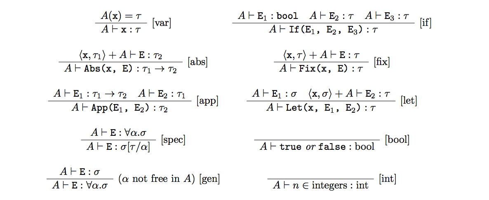

# w

Algorithm W is a relatively fast algorithm, performing type inference in almost linear time with respect to the size of the source, making it practically usable to type large programs. The algorithm is implemented in SML.

## Milner syntax

Milner is based on the Hindley-Milner 1 polymorphic λ-calculus which has a close formal analysis and proof by Damas2. The language has simple integer and boolean types and a small set of primitive functions for manipulating these. The following abstract syntax describes Milner:

    <expr> ::= <abs> | <fix> | <app> | <let> | <cond> | <var> | <val>
    <abs>  ::= Abs(<var>, <expr>)
    <fix>  ::= Fix(<var>, <expr>)
    <app>  ::= App(<expr>, <expr>)
    <let>  ::= Let(<var>, <expr1>, <expr2>)
    <cond> ::= If(<expr1>, <expr2>, <expr3>)
    <var>  ::= Var(<any string>)
    <val>  ::= Int(<any int>) | Bool(<any bool>) | Prim(<any prim>)
    <prim> ::= add | neg | mult | div | and | or | not | eq | lt | gt

## Type inferencer

The type inferencer for Milner expressions enforces the following type rules:

It also contains the following type assumptions predefined as primitive functions:

    addition: add: int -> (int -> int)
    numeric negation: neg: int -> int
    multiplication: mult: int -> (int -> int) 4. division: div: int -> (int -> int)
    conjunction: and: bool -> (bool -> bool) 6. disjunction: or: bool -> (bool -> bool)
    logical negation: not: bool -> bool
    numeric equality: eq: int -> (int -> bool) 9. less than: lt: int -> (int -> bool)
    greater than: gt: int -> (int -> bool)

## The Inference Algorithm W

    W(A, x) = <[], tau>
    W(A, Abs(x, E)) =
      let
        <S, tau> = W((x,alpha)+A, E)
      in
        <S, (alpha S)->tau>
    W(A, App(E1, E2)) =
      let
        <S1, tau1> = W(A, E1)
        <S2, tau2> = W(A S1, E2)
        S3 = unify(tau1 S2, tau2->alpha)
      in
        <S3 o S2 o S1, alpha S3>
    W(A, Let(x, E1, E2)) =
      let
        <S1, tau1> = W(A, E1)
        <S2, tau2> = W(((x,tau1’)+A) S1, E2)
        where tau1’ = tau1 with all variables not in (A S1) quantified
      in
        <S2 o S1, tau2>
    W(A, If(E1, E2, E3)) =
      let
        <S1, tau1> = W(A, E1)
        S2 = unify(bool, tau1)
        <S3, tau3> = W(A (S2 o S1), E2)
        <S4, tau4> = W(A (S3 o S2 o S1), E3)
        S5 = unify(tau3 S4, tau4)
      in
        <S5 o S4 o S3 o S2 o S1, tau4 S5>
    W(A, Fix(x, E)) =
      let
        <S1, tau1> = W((x,alpha)+A, E)
        S2 = unify(alpha S1, tau1)
      in
        <S2 o S1, alpha (S2 o S1)>
        where alpha is a new type variable

1. http://web.cs.wpi.edu/~cs4536/c12/milner-type-poly.pdf
2. http://web.cs.wpi.edu/~cs4536/c12/milner-damas_principal_types.pdf
